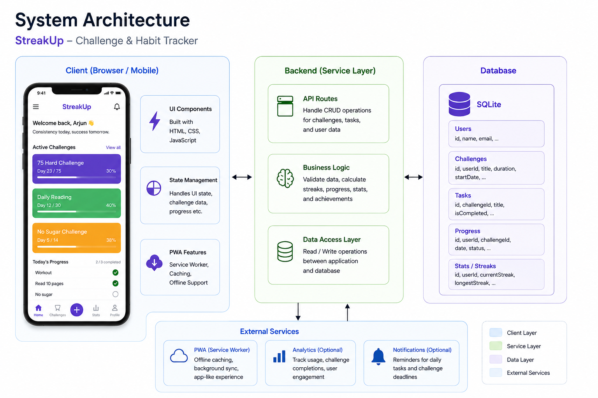

# 🚀 DayForge — Challenge & Habit Tracker

Build consistency one day at a time.

## Live Demo

https://streakupbyrev.netlify.app/

---

## 📖 Overview

DayForge is a lightweight challenge and habit tracking application designed to help users stay consistent with personal goals and self-improvement journeys.

Whether you're completing a 30-Day Fitness Challenge, 75 Hard, Daily Reading Challenge, Coding Streak, Meditation Practice, or any custom goal, DayForge provides a simple way to track progress, maintain motivation, and visualize achievements.

The application focuses on consistency over perfection, helping users build momentum through small daily actions.

---

## 🎯 Problem Statement

Many people begin personal challenges with enthusiasm but struggle to maintain consistency over time.

Traditional note-taking apps and spreadsheets often:

* Require manual organization
* Lack visual progress tracking
* Do not provide a sense of achievement
* Become difficult to manage across multiple challenges

DayForge addresses these issues by providing a dedicated challenge-tracking experience with clear progress visualization and milestone tracking.

---
## 🏗️ System Architecture

The application follows a lightweight client-side architecture where user interactions, challenge tracking, and progress management are handled within the browser. Data persistence is achieved through local storage, while PWA capabilities enable installation and offline usage.

---

## 💡 Significance

Consistency is one of the strongest predictors of long-term success in learning, fitness, productivity, and personal growth.

DayForge encourages:

* Daily accountability
* Habit formation
* Goal commitment
* Progress awareness
* Long-term self-discipline

Instead of focusing only on outcomes, the application emphasizes the process of showing up every day.

---

## 🌍 Impact

### For Students

* Track study streaks
* Monitor exam preparation plans
* Build learning habits

### For Fitness Enthusiasts

* Track workout challenges
* Monitor exercise consistency
* Maintain fitness routines

### For Professionals

* Build productivity habits
* Track skill development goals
* Maintain learning schedules

### For Personal Growth

* Reading challenges
* Meditation practices
* Journaling streaks
* Digital detox programs

---

## ✨ Features

### 📅 Challenge Management

* Create custom challenges
* Set challenge duration
* Define personal goals
* Track daily completion

### 🔥 Streak Tracking

* Current streak counter
* Longest streak record
* Consistency monitoring

### 📊 Progress Analytics

* Challenge completion percentage
* Visual progress indicators
* Milestone achievements

### 🎯 Goal Monitoring

* Active challenge dashboard
* Completed challenge history
* Performance insights

### 💾 Local Storage Support

* Data persists between sessions
* No account required
* Fast and lightweight

### 📱 Mobile Friendly

* Responsive design
* Works on phones, tablets, and desktops
* Installable as a Progressive Web App (PWA)

---

## 📱 Using DayForge as a Mobile App

DayForge can be installed directly on Android and iPhone without downloading from an app store.

### Android (Chrome)

1. Open the live application URL.
2. Tap the browser menu (⋮).
3. Select **Add to Home Screen** or **Install App**.
4. Launch DayForge from your home screen like a native application.

### iPhone (Safari)

1. Open the application URL in Safari.
2. Tap the **Share** button.
3. Select **Add to Home Screen**.
4. Tap **Add**.

Benefits:

* Full-screen experience
* Home-screen icon
* Faster access
* Offline support (if PWA enabled)

---

## 🛠️ Tech Stack

| Layer          | Technology                |
| -------------- | ------------------------- |
| Frontend       | HTML5, CSS3, JavaScript   |
| Storage        | Local Storage             |
| Hosting        | Netlify / GitHub Pages    |
| Mobile Support | Progressive Web App (PWA) |

---

## 📂 Project Structure

dayforge/
├── index.html
├── style.css
├── script.js
├── manifest.json
├── service-worker.js
└── assets/

---

## 🚀 Deployment

### Netlify

1. Zip the project folder.
2. Upload to Netlify Drop.
3. Receive a live URL instantly.
4. Install on mobile using "Add to Home Screen".

### GitHub Pages

1. Push repository to GitHub.
2. Enable GitHub Pages.
3. Access the generated URL.
4. Install as a PWA.

---

## 🔮 Future Enhancements

* Cloud synchronization
* User authentication
* Social challenge sharing
* Achievement badges
* Calendar integration
* Push notifications
* Data export and backup

---

## 📄 License

MIT License

Free to use, modify, and distribute.

---

Built to prove that small daily actions create extraordinary long-term results.
